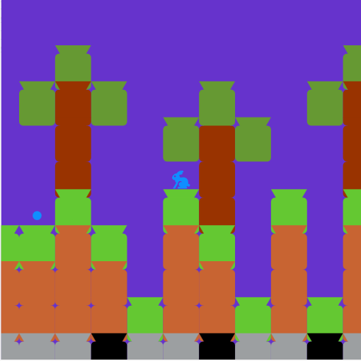

#
# Strona projektu
https://mikolajchajewski.wixsite.com/pixcraft
# Opis
Jest to port gry Minecraft w programie PixBlocks.
# Sterowanie
A,D: Poruszanie postacią na bok.
Spacja: Skok Postaci.
P: Pauza.
LPM: Postawienie\Zniszczenie bloku.
M: Zmiana akcji.

